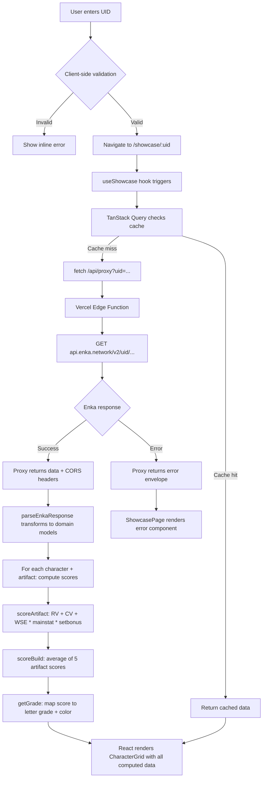
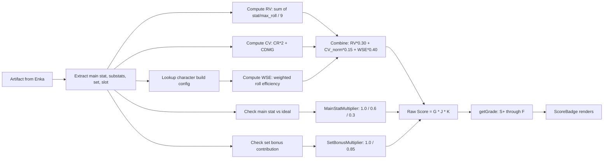

# Genshin ArtScore — Development Plan

> **Codename:** genshin-artscore
> **Stack:** React 19 + TypeScript + Vite, TailwindCSS, Vercel Edge Functions (serverless proxy)
> **Inspiration:** [Fribbels HSR Relic Optimizer Showcase](https://fribbels.github.io/hsr-optimizer#showcase?id=700600838)
> **Scope:** UID input → artifact showcase with quality scoring. No optimizer, no team builder, no damage calculator.

---

## Table of Contents

1. [User Flow](#1-user-flow)
2. [Data Sources & API Integration](#2-data-sources--api-integration)
3. [Artifact Scoring Methodology](#3-artifact-scoring-methodology)
4. [Component-Level UI Structure](#4-component-level-ui-structure)
5. [Technology Stack](#5-technology-stack)
6. [Edge Cases & Error Handling](#6-edge-cases--error-handling)
7. [Phased Roadmap](#7-phased-roadmap)

---

## 1. User Flow

```
┌─────────────────────────────────────────────────────────────────┐
│                    Genshin ArtScore — Home Page                  │
│                                                                  │
│   ┌──────────────────────────────────────────────────────────┐  │
│   │  🔎  Enter Genshin UID ........................................│  │
│   │  ┌──────────────────────┬────────────────────────────┐   │  │
│   │  │  [ UID input field ] │  [ 🔍 Look Up ] button     │   │  │
│   │  └──────────────────────┴────────────────────────────┘   │  │
│   └──────────────────────────────────────────────────────────┘  │
│                                                                  │
│   [ Recent lookups | saved UIDs (localStorage) ]                 │
│                                                                  │
└─────────────────────────────────────────────────────────────────┘
                              │
                              ▼  (API call to Enka proxy)
                              │
┌─────────────────────────────────────────────────────────────────┐
│                    Showcase Page  (/showcase/:uid)               │
│                                                                  │
│   ┌──────────────────────────────────────────────────────────┐  │
│   │  Player: "Traveler" | AR 60 | WL 8 | UID: 700600838      │  │
│   │  Characters on showcase: 8 | Last updated: 2 hours ago    │  │
│   │  [🔄 Refresh] [📋 Copy URL]                               │  │
│   └──────────────────────────────────────────────────────────┘  │
│                                                                  │
│   ┌──────────────────────┐ ┌──────────────────────┐             │
│   │  ┌────────────────┐  │ │  ┌────────────────┐  │  ...up to  │
│   │  │  Character     │  │ │  │  Character     │  │  8 cards   │
│   │  │  Icon + Lv.90  │  │ │  │  Icon + Lv.90  │  │  in a      │
│   │  ├────────────────┤  │ │  ├────────────────┤  │  responsive │
│   │  │ Set Bonuses    │  │ │  │ Set Bonuses    │  │  grid      │
│   │  │ 2‑pc / 4‑pc    │  │ │  │ 2‑pc / 4‑pc    │  │            │
│   │  ├────────────────┤  │ │  ├────────────────┤  │            │
│   │  │ Artifact Cards │  │ │  │ Artifact Cards │  │            │
│   │  │ ┌────────────┐ │  │ │  │ ┌────────────┐ │  │            │
│   │  │ │ Flower  ⭐85│ │  │ │  │ │ Plume  ⭐92 │ │  │            │
│   │  │ └────────────┘ │  │ │  │ └────────────┘ │  │            │
│   │  │ ┌────────────┐ │  │ │  │ ┌────────────┐ │  │            │
│   │  │ │ Sands  ⭐67 │ │  │ │  │ │ Goblet ⭐74 │ │  │            │
│   │  │ └────────────┘ │  │ │  │ └────────────┘ │  │            │
│   │  │ ┌────────────┐ │  │ │  │ ┌────────────┐ │  │            │
│   │  │ │Circlet ⭐81 │ │  │ │  │ │Circlet ⭐88 │ │  │            │
│   │  │ └────────────┘ │  │ │  │ └────────────┘ │  │            │
│   │  ├────────────────┤  │ │  ├────────────────┤  │            │
│   │  │ Overall: ⭐83  │  │ │  │ Overall: ⭐86  │  │            │
│   │  │ ████████░░ 83% │  │ │  │ █████████░ 86%│  │            │
│   │  └────────────────┘  │ │  └────────────────┘  │            │
│   └──────────────────────┘ └──────────────────────┘             │
└─────────────────────────────────────────────────────────────────┘
```

### Step-by-step user journey:

| Step | Action | System Response |
|------|--------|-----------------|
| 1 | User lands on home page | Empty state with UID input front and center, brief tagline explaining the tool |
| 2 | User types their 9‑digit Genshin UID and presses Enter or clicks "Look Up" | Input validated client-side (numeric, 9 digits). Loading skeleton appears. |
| 3 | Client calls the Vercel Edge Function proxy | Proxy forwards request to [`Enka.Network`](https://api.enka.network/) and returns parsed JSON |
| 4 | Data processing | Artifacts extracted, mapped to character slots, scores computed per artifact and per build |
| 5 | Showcase renders | Character cards populate in a responsive 2‑ or 3‑column grid, each with artifact cards, substat breakdowns, and score bar |
| 6 | User shares URL | URL is already at `/showcase/:uid` — copy-paste ready. Visiting the URL directly loads the same showcase immediately. |
| 7 | User refreshes to get updated data | "Refresh" button re-fetches from Enka (with a `t` cache-buster param). Enka data is cached upstream for ~5 min. |

---

## 2. Data Sources & API Integration

### 2.1 Primary Data Source: Enka.Network

Enka is the de-facto standard for retrieving Genshin Impact character showcase data. It scrapes the in-game character showcase via Mihoyo's own API and normalizes the response.

| Property | Details |
|----------|---------|
| **Endpoint** | `https://api.enka.network/v2/uid/:uid` |
| **Auth** | No auth required (public); a `User-Agent` header is recommended |
| **Rate Limit** | ~100 requests/min per IP (with burst tolerance) |
| **Response Format** | JSON — includes `playerInfo`, `avatarInfoList` with equipped artifacts, weapons, constellations, talent levels, and character stats |
| **CORS** | Enka's API does **not** include `Access-Control-Allow-Origin: *` for browser requests, hence the need for a proxy |

#### Sample relevant fields from Enka response:

```jsonc
{
  "playerInfo": {
    "nickname": "Traveler",
    "level": 60,
    "worldLevel": 8,
    "profilePicture": { /* avatar ID */ },
    "signature": "..."
  },
  "avatarInfoList": [
    {
      "avatarId": 10000062,         // Maps to Alhaitham
      "level": 90,
      "talentIdList": [10313, 10312, 10311],  // talent IDs
      "equipList": [
        {
          "itemId": 95540,         // 5-star artifact piece ID
          "reliquary": {
            "level": 20,
            "mainPropId": "FIGHT_PROP_HP",
            "appendPropIdList": [
              { "propType": "FIGHT_PROP_CRITICAL", "propValue": 7.8 },
              { "propType": "FIGHT_PROP_CRITICAL_HURT", "propValue": 15.5 },
              { "propType": "FIGHT_PROP_ATTACK_PERCENT", "propValue": 5.3 },
              { "propType": "FIGHT_PROP_ELEMENT_MASTERY", "propValue": 23.0 }
            ]
          },
          "flat": {
            "nameTextMapHash": "...",
            "setNameTextMapHash": "...",
            "icon": "UI_RelicIcon_15028_4",
            "equipType": "EQUIP_BRACER",  // Flower
            "rankLevel": 5,               // 5-star
            "reliquaryMainstat": {
              "mainPropId": "FIGHT_PROP_HP",
              "statValue": 4780.0
            },
            "reliquarySubstats": [
              { "appendPropId": "FIGHT_PROP_CRITICAL", "statValue": 7.8 },
              { "appendPropId": "FIGHT_PROP_CRITICAL_HURT", "statValue": 15.5 },
              { "appendPropId": "FIGHT_PROP_ATTACK_PERCENT", "statValue": 5.3 },
              { "appendPropId": "FIGHT_PROP_ELEMENT_MASTERY", "statValue": 23.0 }
            ]
          }
        }
        // ... 4 more artifact slots + 1 weapon
      ]
    }
    // ... up to 8 characters
  ]
}
```

### 2.2 Static Data Sources (bundled with the app)

These are JSON mapping files sourced from the community-maintained [Dimbreath/GenshinData](https://github.com/Dimbreath/GenshinData) repository, processed at build time:

| Data File | Content | Source |
|-----------|---------|--------|
| `characters.json` | Character ID → name, element, weapon type, ascension stat | `AvatarExcelConfigData.json` |
| `artifacts.json` | Set ID → set name, icons, 2‑pc / 4‑pc descriptions | `ReliquarySetExcelConfigData.json` |
| `artifact-pieces.json` | Piece ID → slot type, set ID, icon path | `ReliquaryExcelConfigData.json` |
| `stat-keys.json` | `FIGHT_PROP_*` → display name (e.g. "CRIT Rate"), icon, formatting | Mapped manually |
| `character-builds.json` | **Custom file** — character ID → recommended artifact sets, main stats per slot, substat priority weights, ER thresholds | Curation required (see §3.4) |

### 2.3 Proxy Architecture

```
 Browser                 Vercel Edge Function          Enka.Network
 ┌────────┐             ┌─────────────────────┐        ┌──────────┐
 │ React  │── GET ────▶ │ /api/proxy?uid=123  │──────▶ │ Enka API │
 │ App    │◀── JSON ─── │                     │◀────── │          │
 └────────┘             │ + CORS headers       │        └──────────┘
                        │ + error handling     │
                        │ + optional caching   │
                        └─────────────────────┘
```

**Vercel Edge Function** ([`api/proxy.ts`](api/proxy.ts)):

- Accepts `uid` query parameter
- Validates UID format (9 digits, numeric)
- Forwards to `https://api.enka.network/v2/uid/:uid`
- Applies `Access-Control-Allow-Origin: *` to the response
- Handles Enka error codes (400 = bad UID, 424 = maintenance, 429 = rate limit, 503 = game server down)
- Returns a typed JSON envelope: `{ success: true, data: EnkaResponse } | { success: false, error: string }`
- Optional: short in-memory/edge-cache TTL (60s) to reduce redundant calls

**Why not a full backend?** The only backend responsibility is CORS proxying. Enka already handles the heavy lifting. A serverless edge function is free-tier friendly on Vercel and has single-digit-millisecond cold starts globally.

### 2.4 UID Validation Rules

| Rule | Implementation |
|------|---------------|
| Must be exactly 9 digits | Regex: `/^\d{9}$/` |
| Must not start with `0` | The first digit for Genshin UIDs is region-coded (1–9) |
| Server region hint | Optional: parse first digit to show flag (1=Celestia, 6=America, 7=Europe, 8=Asia, 9=TW/HK/MO) |

---

## 3. Artifact Scoring Methodology

### 3.1 Core Concepts

The scoring system evaluates each artifact and the overall build relative to the **theoretical maximum** for that character's optimal configuration. Three complementary metrics are computed, then combined into a weighted final score.

### 3.2 Roll Value (RV)

**Definition:** A measure of how "rolled" a substat is relative to its maximum possible roll. Each substat line starts with a base roll and gains additional rolls at levels 4, 8, 12, 16, and 20. A 5-star artifact starting with 4 substats has 5 upgrade rolls; starting with 3 substats has 4 upgrade rolls.

**Formula:**
```
Per-stat RV = (stat_value / max_possible_roll) * 100%
Total RV    = sum of per-stat RVs / 9  (ideal: 5 base rolls + 4 from upgrades)
```

**Max roll reference table (5-star artifacts):**

| Substats | Max Roll |
|----------|----------|
| ATK% / DEF% / HP% | 5.83% |
| CRIT Rate | 3.89% |
| CRIT DMG | 7.77% |
| Elemental Mastery | 23.31 |
| Energy Recharge | 6.48% |
| Flat ATK | 19.45 |
| Flat DEF | 23.15 |
| Flat HP | 298.75 |

**Example:** An artifact with CRIT Rate 7.8%, CRIT DMG 15.5%, ATK% 5.3%, EM 23:

```
CRIT Rate:  7.8 / 3.89  = 2.00 rolls
CRIT DMG:  15.5 / 7.77  = 1.99 rolls
ATK%:       5.3 / 5.83  = 0.91 rolls
EM:        23.0 / 23.31 = 0.99 rolls
Total RV = (2.00 + 1.99 + 0.91 + 0.99) / 9 = 65.4%
```

### 3.3 Crit Value (CV)

**Definition:** A simplified metric focused purely on offensive stats. Widely used in the Genshin community.

**Formula:**
```
CV = (CRIT Rate * 2) + CRIT DMG
```

**Interpretation:**
| CV Range | Community Label |
|----------|-----------------|
| 0–20 | Copium |
| 20–30 | Decent |
| 30–40 | Good |
| 40–50 | Great |
| 50+ | God Piece |

**CV only applies to Flower, Plume, Sands, Goblet, Circlet** — it is computed per artifact and summed for the build.

### 3.4 Weighted Substats Efficiency (WSE)

**Definition:** Unlike RV and CV (which are character-agnostic), WSE weights each substats by how valuable it is for a specific character. This is the most meaningful score for evaluating a build.

**The character-builds.json file** defines, for each character:

```jsonc
{
  "10000062": {  // Alhaitham
    "name": "Alhaitham",
    "substats_weights": {
      "CRIT_RATE": 1.0,
      "CRIT_DMG": 1.0,
      "ELEMENTAL_MASTERY": 0.9,
      "ATK_PERCENT": 0.5,
      "ENERGY_RECHARGE": 0.3,
      "HP_PERCENT": 0.0,
      "DEF_PERCENT": 0.0,
      "FLAT_ATK": 0.1,
      "FLAT_HP": 0.0,
      "FLAT_DEF": 0.0
    },
    "main_stats_ideal": {
      "SANDS": ["ELEMENTAL_MASTERY", "ATK_PERCENT"],
      "GOBLET": ["DENDRO_DMG"],
      "CIRCLET": ["CRIT_RATE", "CRIT_DMG"]
    },
    "recommended_sets": ["15028", "15030"],  // Gilded Dreams, Deepwood Memories
    "er_threshold": 130
  }
}
```

**Formula:**
```
WSE = Σ (stat_value / max_roll * weight) / Σ (max_possible_weight)
    = Σ (rolls_per_stat * weight) / Σ (4_substats * 1.0)
```

This normalizes to 0–100% where 100% means every substat is a max roll of the most valuable stats.

### 3.5 Main Stats Check

Main stats are scored separately: **Does the artifact's main stat match the character's recommended main stats for its slot?**

| Slot | Possible Main Stats | Scored |
|------|-------------------|--------|
| Flower | Always HP | ✅ Always correct (free points) |
| Plume | Always ATK | ✅ Always correct |
| Sands | ATK% / DEF% / HP% / EM / ER% | ✅ if matches ideal set |
| Goblet | Element DMG% / ATK% / DEF% / HP% / EM | ✅ if matches ideal set |
| Circlet | CRIT Rate / CRIT DMG / ATK% / DEF% / HP% / Healing% / EM | ✅ if matches ideal set |

**Main stat correctness is a binary multiplier:** correct = 1.0, off-piece but usable = 0.6, completely wrong = 0.3.

### 3.6 Aggregate Score (per artifact)

```
Artifact Score = (RV * 0.30 + CV_Normalized * 0.15 + WSE * 0.40) * MainStatMultiplier * SetBonusMultiplier
```

Where:
- `CV_Normalized` = min(CV / 50, 1.0) — caps at 50 CV
- `SetBonusMultiplier` = 1.0 if the artifact contributes to an active 2‑pc or 4‑pc set bonus, 0.85 if off-set (only for Goblet, which is commonly off-set in Genshin)
- Final score ranges from 0–100, displayed as a letter grade + color:

| Score | Grade | Color |
|-------|-------|-------|
| 90–100 | S+ | Gold |
| 80–89 | S | Orange |
| 70–79 | A | Purple |
| 60–69 | B | Blue |
| 50–59 | C | Green |
| 40–49 | D | Gray |
| <40 | F | Red |

### 3.7 Build Score (overall per character)

```
Build Score = Σ (Artifact Score_i) / 5
```

The build score is displayed as a prominent badge on each character card with a color-coded progress bar.

### 3.8 Set Bonus Grid

Display which artifact sets are active on each character:

| Slot | Set Name | Piece |
|-------|----------|-------|
| Flower | Deepwood Memories | ✅ |
| Plume | Deepwood Memories | ✅ |
| Sands | Gilded Dreams | ✅ |
| Goblet | Gilded Dreams | ✅ |
| Circlet | Deepwood Memories | ✅ |

→ **Set Bonuses:** Deepwood Memories (2‑pc), Gilded Dreams (2‑pc) — no 4‑pc active.

Visual: a 5-circle grid (like the Fribbels relic grid) where matching set pieces share a background color.

---

## 4. Component-Level UI Structure

### 4.1 Component Tree

```
<App>
  ├── <Router> (React Router v7)
  │   ├── Route "/" → <HomePage>
  │   │   ├── <Header />                   ← logo, navigation
  │   │   ├── <UidInput />                  ← text field + submit button
  │   │   │   └── <RegionFlag />            ← inferred from UID prefix
  │   │   └── <RecentLookups />             ← localStorage history
  │   │
  │   ├── Route "/showcase/:uid" → <ShowcasePage>
  │   │   ├── <PlayerHeader />              ← nickname, AR, WL, avatar, last-updated
  │   │   │   └── <RefreshButton />
  │   │   ├── <ShowcaseControls />          ← copy URL, toggle view
  │   │   ├── <CharacterGrid>               ← responsive CSS grid
  │   │   │   └── <CharacterCard /> × N
  │   │   │       ├── <CharacterHeader />   ← icon, name, level, element badge
  │   │   │       ├── <SetBonusGrid />      ← 5‑slot grid, color-coded by set
  │   │   │       ├── <ArtifactCard /> × 5
  │   │   │       │   ├── <ArtifactIcon />  ← artifact piece icon
  │   │   │       │   ├── <MainStatBadge /> ← main stat name + value
  │   │   │       │   ├── <SubstatsRoll />
  │   │   │       │   │   └── <SubstatBar /> × 4
  │   │   │       │   │       ├── stat name + value
  │   │   │       │   │       ├── roll count dots
  │   │   │       │   │       └── color-coded bar (green→yellow→red)
  │   │   │       │   └── <ScoreBadge />    ← numeric score + letter grade
  │   │   │       └── <BuildScoreBar />     ← overall score bar
  │   │   └── <Footer />
  │   │
  │   └── Route "*" → <NotFoundPage />
```

### 4.2 Component Specifications

#### `<UidInput />`

- **Purpose:** Single-field form for entering a Genshin UID.
- **Behavior:**
  - Input mask: only digits, max 9 characters.
  - Client-side validation: regex `/^\d{9}$/`, first digit 1–9.
  - On valid submit: `navigate('/showcase/' + uid)`.
  - Pulsing glow animation on the input border (brand accent color) to draw attention.
  - Shows clear error message for invalid input ("UID must be exactly 9 digits").
- **States:** idle, focused, invalid, submitting (button shows spinner).

#### `<PlayerHeader />`

- **Purpose:** Displays account-level info at the top of the showcase.
- **Content:**
  - Profile picture (Enka provides the avatar icon ID → mapped to local asset or CDN URL).
  - Nickname, Adventure Rank, World Level.
  - Number of characters on showcase (e.g., "8 characters").
  - "Last updated: X minutes ago" (derived from Enka's `ttl` field or fetch timestamp).
  - Action buttons: Refresh (re-fetch), Copy URL (clipboard API).

#### `<CharacterCard />`

- **Purpose:** Container for one character's full artifact showcase.
- **Layout:** Card with subtle dark background, 1px border, rounded corners (12px). Top section: character icon (circular, 72px) + name + level + element icon. Middle: 5 artifact cards stacked vertically or in a compact 2+3 grid. Bottom: build score bar.
- **Expand/collapse:** Each card can be collapsed to show only the header and overall score for dense browsing; click to expand.
- **Responsive:** Cards span 100% on mobile, 50% on tablet, 33% on desktop.

#### `<ArtifactCard />`

- **Purpose:** Displays one artifact piece with its details.
- **Layout (compact, inline):**
  ```
  ┌──────────────────────────────────────────────────────┐
  │ [Icon]  Flower of Life           Lv.20     ⭐ 85  S │
  │          HP 4,780                                    │
  │  CRIT Rate     7.8%   ████████░░   ●●○○○           │
  │  CRIT DMG     15.5%   █████████░   ●●●●○           │
  │  ATK%          5.3%   ██████░░░░   ●●○○○           │
  │  Elemental M.   23    ████░░░░░░   ●○○○○           │
  └──────────────────────────────────────────────────────┘
  ```
- **Substat rows:** Each row shows the stat name, value, a horizontal bar indicating the roll quality (proportional to max), and roll-count dots (filled circles for each roll).
- **Color coding on substat bars:**
  - Green (≥75% of max roll value): high roll
  - Yellow (50–74%): average roll
  - Red (<50%): low roll
- **Interaction:** Hovering a substat row shows a tooltip: "2.0 rolls out of 2.25 max possible" (or similar).

#### `<SetBonusGrid />`

- **Purpose:** Visualize which set bonuses are active.
- **Layout:** Five circular slots arranged horizontally (like Fribbels' relic grid), each filled with the set's icon/color. Matching sets share the same background color. Active bonuses (2‑pc, 4‑pc) are highlighted with a glow/badge.
- **Example:**
  ```
  ●──●──○──○──●      Deepwood Memories ×3  →  2‑pc active
  Deepwood set color    Gilded Dreams  ×2  →  2‑pc active
  ```

#### `<ScoreBadge />`

- **Purpose:** Prominently display the artifact score.
- **Visual:** A pill-shaped badge with the numeric score and letter grade. Background color matches the grade (gold for S+, red for F). Subtle shimmer animation for S+ pieces.
- **Position:** Top-right corner of each [`ArtifactCard`](components/ArtifactCard.tsx).

#### `<BuildScoreBar />`

- **Purpose:** Overall character build score.
- **Visual:** A horizontal progress bar (0–100%) with gradient fill matching the grade color. Score label centered or to the right.
- **Example:** `██████████░░ 83%  A  ██████████░░`

#### `<SubstatsRoll />`

- **Purpose:** The four substat lines inside an artifact card.
- **Each line:**
  - Stat icon (optional, can use text abbreviation: "CR", "CD", "ATK%", "EM", "ER", etc.)
  - Full stat name on hover/tap
  - Numeric value with appropriate formatting (% or flat)
  - Horizontal bar: width proportional to `value / max_roll`
  - Roll-count dots: each filled dot ≈ 1 full roll equivalent
  - Color coding per the scheme above

### 4.3 Visual Design Principles

| Principle | Implementation |
|-----------|---------------|
| **Dark-first** | Default dark theme (bg: `#0f1117`, cards: `#1a1d2e`, text: `#e4e4e7`). Light theme toggle via CSS variables. |
| **Color palette** | Element-based accent colors (Pyro=red, Hydro=blue, etc.) used sparingly for character card borders and element icons |
| **Typography** | Inter or Geist font family. Monospace for stat values. Consistent sizing: 14px body, 12px labels, 18px headings. |
| **Spacing** | 8px grid system. Cards: 16px padding, 12px gap between artifact cards. |
| **Animations** | Subtle: fade-in on card mount (staggered), pulse on score > 90, skeleton shimmer during loading. No over-the-top transitions. |
| **Distinct from Fribbels** | Different color palette (Genshin-themed gold/teal instead of HSR purple/blue), different card shape (rounded vs sharp), Genshin element icons, 5-slot artifact layout (vs 6 relics in HSR), no Light Cone section |

---

## 5. Technology Stack

| Layer | Technology | Rationale |
|-------|-----------|-----------|
| **Frontend Framework** | React 19 + TypeScript | Confirmed by user. Most ecosystem support, excellent type safety for complex data structures. |
| **Build Tool** | Vite 6 | Fastest DX for React, native ESM, excellent TypeScript support. |
| **Routing** | React Router v7 | File-based or config-based routing. `/` for home, `/showcase/:uid` for showcase. |
| **Styling** | TailwindCSS 4 + CSS Modules (for complex component styles) | Tailwind for rapid layout + utility, CSS Modules for component-specific complex styles (artifact cards, score bars). |
| **State Management** | React Context + `useReducer` for global state (UID, theme). No Redux needed at this scale. | Lightweight, sufficient for a single-page data-fetching app. |
| **Data Fetching** | TanStack Query (React Query) v5 | Caching, refetching, loading/error states out of the box. Stale time: 5 min. |
| **HTTP Client** | Native `fetch` (no Axios needed) | Edge function is a simple GET; no interceptors or complex config required. |
| **Backend/Proxy** | Vercel Edge Function (TypeScript) | One file: [`api/proxy.ts`](api/proxy.ts). Handles CORS, validation, error forwarding. |
| **Hosting** | Vercel (Hobby/Pro tier) | Free tier includes 100k edge function invocations/day — more than enough for an MVP. Custom domain supported. |
| **CI/CD** | GitHub Actions → Vercel (automatic deploy on push to `main`) | Standard. Preview deploys on PR branches. |
| **Testing** | Vitest (unit), React Testing Library (component), Playwright (E2E for UID flow) | Industry-standard, fast, works natively with Vite. |
| **Linting/Formatting** | ESLint (flat config) + Prettier | Enforce consistent code style. |
| **Static Data** | JSON files in `/src/data/`, imported at build time | Characters, artifact sets, stat mappings, character builds. |
| **Analytics (optional)** | Vercel Analytics or Plausible | Privacy-friendly, counts UID lookups without storing UIDs. |

### 5.1 Project Directory Structure

```
genshin-artscore/
├── api/
│   └── proxy.ts                   # Vercel Edge Function
├── public/
│   ├── favicon.ico
│   └── images/
│       ├── elements/              # Element icons (Pyro, Hydro, etc.)
│       ├── artifact-sets/          # Set icons
│       └── characters/             # Character thumbnail icons
├── src/
│   ├── components/
│   │   ├── ui/                    # Primitive UI components
│   │   │   ├── UidInput.tsx
│   │   │   ├── ScoreBadge.tsx
│   │   │   ├── SubstatBar.tsx
│   │   │   ├── SetBonusGrid.tsx
│   │   │   ├── BuildScoreBar.tsx
│   │   │   └── LoadingSkeleton.tsx
│   │   ├── showcase/
│   │   │   ├── PlayerHeader.tsx
│   │   │   ├── CharacterCard.tsx
│   │   │   ├── CharacterGrid.tsx
│   │   │   └── ArtifactCard.tsx
│   │   └── layout/
│   │       ├── Header.tsx
│   │       ├── Footer.tsx
│   │       └── Layout.tsx
│   ├── data/
│   │   ├── characters.json        # Character ID → metadata
│   │   ├── artifacts.json         # Artifact set data
│   │   ├── stat-keys.json         # FIGHT_PROP → display mappings
│   │   └── character-builds.json  # Scoring config per character
│   ├── hooks/
│   │   ├── useShowcase.ts         # Main data fetching hook
│   │   └── useLocalStorage.ts     # Recent UIDs
│   ├── lib/
│   │   ├── scoring.ts             # RV, CV, WSE, aggregate scoring
│   │   ├── parsing.ts             # Transform Enka response → app types
│   │   ├── uid.ts                 # UID validation, region parsing
│   │   └── constants.ts           # Max roll values, grade thresholds
│   ├── pages/
│   │   ├── HomePage.tsx
│   │   ├── ShowcasePage.tsx
│   │   └── NotFoundPage.tsx
│   ├── types/
│   │   ├── enka.ts                # TypeScript types for Enka API response
│   │   ├── artifact.ts            # Processed artifact types
│   │   ├── character.ts           # Processed character types
│   │   └── scoring.ts             # Scoring result types
│   ├── App.tsx
│   ├── main.tsx
│   └── index.css                  # Tailwind directives + CSS custom properties
├── tests/
│   ├── unit/
│   │   ├── scoring.test.ts
│   │   ├── parsing.test.ts
│   │   └── uid.test.ts
│   ├── components/
│   │   ├── UidInput.test.tsx
│   │   ├── ArtifactCard.test.tsx
│   │   └── CharacterCard.test.tsx
│   └── e2e/
│       └── showcase-flow.spec.ts
├── .eslintrc.config.js
├── .prettierrc
├── tailwind.config.ts
├── tsconfig.json
├── vite.config.ts
├── vercel.json
├── package.json
└── README.md
```

---

## 6. Edge Cases & Error Handling

### 6.1 Error States Matrix

| Scenario | Detection | UI Response |
|----------|-----------|-------------|
| **Invalid UID format** | Client-side regex | Inline error below input: "UID must be exactly 9 digits." Input border turns red. |
| **UID not found (Enka 400)** | Proxy returns `{ success: false, error: "UID_NOT_FOUND" }` | Full-page message: "This UID could not be found. The player may not exist or their showcase is not public." + link back to home. |
| **Private profile / no characters on showcase** | Enka returns `avatarInfoList` empty or missing | Message: "This player's character showcase is empty or set to private. They need to enable 'Show Character Details' in-game." |
| **Enka maintenance (424)** | Proxy returns error code 424 | Banner: "Enka.Network is currently undergoing maintenance. Please try again in a few minutes." |
| **Rate limited (429)** | Proxy returns 429 | Toast notification: "Too many requests. Please wait a moment and try again." Auto-retry after 30s. |
| **Game server down (503)** | Proxy returns 503 | Message: "Genshin Impact servers are currently unavailable. This may happen during version updates." |
| **Network error / timeout** | `fetch` throws or times out (10s timeout) | "Unable to connect. Please check your internet connection and try again." + retry button. |
| **Character missing from `character-builds.json`** | Character ID not found in build config | Graceful fallback: use generic substat weights (CRIT_RATE=1, CRIT_DMG=1, ATK%=0.5, everything else=0). Display a subtle "⚙ Generic scoring" badge. |
| **Unbuilt character (low level, no artifacts equipped)** | Some artifact slots are empty in `equipList` | Show the character card but display "No artifacts equipped" placeholders for empty slots. Do not compute a build score (show "N/A"). |
| **Partially built (some artifacts missing)** | Some `equipList` entries missing for certain slots | Show equipped artifacts with scores; missing slots show a grayed-out placeholder: "No [Flower] equipped." Build score is averaged only over equipped pieces, with a note: "Score based on X/5 artifacts." |
| **Old/bugged Enka data** | Unexpected field types, missing fields | Defensive parsing: all fields use optional chaining and defaults. Log warnings to console in dev mode. |

### 6.2 Loading States

| Stage | Visual |
|-------|--------|
| **UID submitted** | Skeleton shimmer: character cards as gray rectangles with animated shine. |
| **Data fetched, scoring in progress** | (Scoring is synchronous and <50ms for 8 characters — no intermediate loading needed) |
| **Image loading** | Blurred low-res placeholder → fade-in to full image. |

### 6.3 Empty States

| Component | Empty State |
|-----------|-------------|
| **Recent lookups (home page)** | "No recent lookups yet. Enter a UID above to get started!" |
| **Character grid** | "No characters found on this showcase." |

### 6.4 Caching & Staleness

- **Enka data TTL:** Enka provides a `ttl` field (seconds until data is stale). Display "Last updated X minutes ago" and show a subtle "data may be stale" indicator after TTL expires.
- **React Query stale time:** 5 minutes. Data is served from cache within that window.
- **Manual refresh:** User can click "Refresh" to force a refetch. This adds a cache-busting `t` parameter.

---

## 7. Phased Roadmap

### Phase 0: Project Scaffolding & Tooling (Foundation)

**Goal:** A running dev environment with the full build pipeline.

| # | Task | Deliverable | Dependencies |
|---|------|-------------|--------------|
| 0.1 | Initialize Vite + React + TypeScript project with `npm create vite@latest` | [`package.json`](package.json), [`vite.config.ts`](vite.config.ts), [`tsconfig.json`](tsconfig.json) | None |
| 0.2 | Install and configure TailwindCSS 4, PostCSS | [`tailwind.config.ts`](tailwind.config.ts), [`src/index.css`](src/index.css) | 0.1 |
| 0.3 | Set up ESLint flat config + Prettier | [`.eslintrc.config.js`](.eslintrc.config.js), [`.prettierrc`](.prettierrc) | 0.1 |
| 0.4 | Configure React Router v7 with routes: `/`, `/showcase/:uid`, `*` | [`src/App.tsx`](src/App.tsx) | 0.1 |
| 0.5 | Create the base [`Layout`](src/components/layout/Layout.tsx) component (header, main, footer shell) | [`src/components/layout/Layout.tsx`](src/components/layout/Layout.tsx) | 0.4 |
| 0.6 | Set up Vitest + React Testing Library + Playwright | [`vitest.config.ts`](vitest.config.ts), test setup files | 0.1 |
| 0.7 | Configure Vercel deployment (`vercel.json`) and GitHub Actions for CI/CD | [`vercel.json`](vercel.json), [`.github/workflows/ci.yml`](.github/workflows/ci.yml) | 0.1 |
| 0.8 | Set up the CSS custom property system (dark/light theme tokens) | [`src/index.css`](src/index.css) — `:root` variables | 0.2 |
| 0.9 | Create placeholder pages: [`HomePage`](src/pages/HomePage.tsx), [`ShowcasePage`](src/pages/ShowcasePage.tsx), [`NotFoundPage`](src/pages/NotFoundPage.tsx) | Page shell components | 0.4 |

---

### Phase 1: Data Layer — Types, Static Data & API Proxy

**Goal:** All data definitions, static mapping files, and the serverless proxy are operational.

| # | Task | Deliverable | Dependencies |
|---|------|-------------|--------------|
| 1.1 | Define TypeScript types for the full Enka API response | [`src/types/enka.ts`](src/types/enka.ts) | 0.1 |
| 1.2 | Define TypeScript types for processed/domain models (Character, Artifact, BuildScore, etc.) | [`src/types/artifact.ts`](src/types/artifact.ts), [`src/types/character.ts`](src/types/character.ts), [`src/types/scoring.ts`](src/types/scoring.ts) | 1.1 |
| 1.3 | Create static data files from Dimbreath/GenshinData exports | [`src/data/characters.json`](src/data/characters.json), [`src/data/artifacts.json`](src/data/artifacts.json), [`src/data/stat-keys.json`](src/data/stat-keys.json) | 1.1 |
| 1.4 | Create the initial [`character-builds.json`](src/data/character-builds.json) — curate substat weights and ideal main stats for 20+ popular characters | [`src/data/character-builds.json`](src/data/character-builds.json) | 1.3 |
| 1.5 | Implement the Vercel Edge Function proxy (`api/proxy.ts`) | [`api/proxy.ts`](api/proxy.ts) | 0.7 |
| 1.6 | Write UID validation and region-parsing utilities | [`src/lib/uid.ts`](src/lib/uid.ts) | 0.1 |
| 1.7 | Write the Enka response → domain model parser | [`src/lib/parsing.ts`](src/lib/parsing.ts) | 1.2, 1.3 |
| 1.8 | Implement the `useShowcase` hook with TanStack Query | [`src/hooks/useShowcase.ts`](src/hooks/useShowcase.ts) | 1.5, 1.7 |
| 1.9 | Write unit tests for parsing and UID validation | [`tests/unit/parsing.test.ts`](tests/unit/parsing.test.ts), [`tests/unit/uid.test.ts`](tests/unit/uid.test.ts) | 1.7, 1.6 |

---

### Phase 2: Artifact Scoring Engine

**Goal:** The scoring engine is fully functional and tested in isolation.

| # | Task | Deliverable | Dependencies |
|---|------|-------------|--------------|
| 2.1 | Define max roll value constants for all substats | [`src/lib/constants.ts`](src/lib/constants.ts) | None |
| 2.2 | Implement Roll Value (RV) calculator | `computeRV()` in [`src/lib/scoring.ts`](src/lib/scoring.ts) | 2.1 |
| 2.3 | Implement Crit Value (CV) calculator | `computeCV()` in [`src/lib/scoring.ts`](src/lib/scoring.ts) | 2.1 |
| 2.4 | Implement Weighted Substats Efficiency (WSE) calculator using character-builds.json | `computeWSE()` in [`src/lib/scoring.ts`](src/lib/scoring.ts) | 1.4, 2.1 |
| 2.5 | Implement main stats correctness check | `checkMainStats()` in [`src/lib/scoring.ts`](src/lib/scoring.ts) | 1.4 |
| 2.6 | Implement set bonus detection and multiplier | `computeSetBonus()` in [`src/lib/scoring.ts`](src/lib/scoring.ts) | 1.7 |
| 2.7 | Implement aggregate artifact score (RV + CV + WSE combined) | `scoreArtifact()` in [`src/lib/scoring.ts`](src/lib/scoring.ts) | 2.2–2.6 |
| 2.8 | Implement build-level aggregate score | `scoreBuild()` in [`src/lib/scoring.ts`](src/lib/scoring.ts) | 2.7 |
| 2.9 | Implement the grade mapping (score → S+/S/A/B/C/D/F + color) | `getGrade()` in [`src/lib/scoring.ts`](src/lib/scoring.ts) | 2.7 |
| 2.10 | Write comprehensive unit tests for all scoring functions with known test cases | [`tests/unit/scoring.test.ts`](tests/unit/scoring.test.ts) | 2.2–2.9 |

---

### Phase 3: Core UI Components (Atomic & Molecule)

**Goal:** All reusable UI components are built and visually polished in isolation (Storybook optional but recommended).

| # | Task | Deliverable | Dependencies |
|---|------|-------------|--------------|
| 3.1 | Build `<UidInput />` component with validation, animations, region flag | [`src/components/ui/UidInput.tsx`](src/components/ui/UidInput.tsx) | 1.6 |
| 3.2 | Build `<ScoreBadge />` component (numeric score + letter grade + color) | [`src/components/ui/ScoreBadge.tsx`](src/components/ui/ScoreBadge.tsx) | 2.9 |
| 3.3 | Build `<SubstatBar />` component (stat name, value, roll bar, roll dots, color coding) | [`src/components/ui/SubstatBar.tsx`](src/components/ui/SubstatBar.tsx) | 2.1 |
| 3.4 | Build `<ArtifactCard />` component (icon, main stat, 4 substat bars, score badge) | [`src/components/showcase/ArtifactCard.tsx`](src/components/showcase/ArtifactCard.tsx) | 3.2, 3.3 |
| 3.5 | Build `<SetBonusGrid />` component (5-circle grid, color-coded, bonus badges) | [`src/components/ui/SetBonusGrid.tsx`](src/components/ui/SetBonusGrid.tsx) | 1.7 |
| 3.6 | Build `<BuildScoreBar />` component (horizontal progress bar with gradient + grade) | [`src/components/ui/BuildScoreBar.tsx`](src/components/ui/BuildScoreBar.tsx) | 2.8, 2.9 |
| 3.7 | Build `<CharacterCard />` component (composes header + set grid + 5 artifact cards + build score) | [`src/components/showcase/CharacterCard.tsx`](src/components/showcase/CharacterCard.tsx) | 3.4, 3.5, 3.6 |
| 3.8 | Build `<CharacterGrid />` component (responsive grid of character cards) | [`src/components/showcase/CharacterGrid.tsx`](src/components/showcase/CharacterGrid.tsx) | 3.7 |
| 3.9 | Build `<PlayerHeader />` component (nickname, AR, WL, avatar, refresh/copy buttons) | [`src/components/showcase/PlayerHeader.tsx`](src/components/showcase/PlayerHeader.tsx) | 1.7 |
| 3.10 | Build `<LoadingSkeleton />` component (animated shimmer placeholders) | [`src/components/ui/LoadingSkeleton.tsx`](src/components/ui/LoadingSkeleton.tsx) | None |
| 3.11 | Write component tests for UidInput, ArtifactCard, CharacterCard | [`tests/components/`](tests/components/) | 3.1, 3.4, 3.7 |

---

### Phase 4: Page Assembly & Data Flow

**Goal:** Pages are fully wired up with real data flow — UID input → fetch → parse → score → render.

| # | Task | Deliverable | Dependencies |
|---|------|-------------|--------------|
| 4.1 | Implement the [`HomePage`](src/pages/HomePage.tsx): UidInput + recent lookups from localStorage | [`src/pages/HomePage.tsx`](src/pages/HomePage.tsx) | 3.1 |
| 4.2 | Implement the `useLocalStorage` hook for persisting recent UIDs | [`src/hooks/useLocalStorage.ts`](src/hooks/useLocalStorage.ts) | None |
| 4.3 | Implement the [`ShowcasePage`](src/pages/ShowcasePage.tsx): reads `:uid` param, triggers useShowcase, renders PlayerHeader + CharacterGrid | [`src/pages/ShowcasePage.tsx`](src/pages/ShowcasePage.tsx) | 1.8, 3.8, 3.9, 3.10 |
| 4.4 | Wire up Navigation: HomePage → UID submit → navigate to `/showcase/:uid` | [`src/pages/HomePage.tsx`](src/pages/HomePage.tsx) update | 4.1, 4.3 |
| 4.5 | Implement error UI components (not-found, private profile, maintenance, network error) with appropriate copy | Error state components in showcase | 1.8 |
| 4.6 | Add React Query devtools (dev mode only) for debugging data fetching | [`src/main.tsx`](src/main.tsx) | 4.3 |
| 4.7 | Implement scroll-to-top on page navigation | Router config | 4.3 |

---

### Phase 5: Responsive Layout & Visual Polish

**Goal:** The UI matches the design spec across all viewport sizes, with a polished Genshin-inspired aesthetic.

| # | Task | Deliverable | Dependencies |
|---|------|-------------|--------------|
| 5.1 | Implement responsive grid: 1 col (mobile, <640px), 2 col (tablet, 640–1024px), 3 col (desktop, >1024px) | Tailwind responsive classes in CharacterGrid | 3.8 |
| 5.2 | Implement card expand/collapse animation (collapsed shows only header + score) | Framer Motion or CSS transition on CharacterCard | 3.7 |
| 5.3 | Add staggered fade-in animation on character cards when showcase loads | CSS `@keyframes` or Framer Motion `staggerChildren` | 3.8 |
| 5.4 | Implement light/dark theme toggle (CSS custom properties swap) | Theme context + toggle button in Header | 0.8, 0.5 |
| 5.5 | Add element-colored accents (character card left border, artifact set matching colors) | CSS based on element type | 3.7 |
| 5.6 | Polish typography, spacing, hover states, focus rings (accessibility) | Audit pass over all components | 4.3 |
| 5.7 | Add `meta` tags (OG tags for link sharing, title, description) | React Helmet or `document.head` manipulation | 4.3 |
| 5.8 | Mobile optimization: touch-friendly tap targets (min 44px), scrollable artifact cards, bottom-sheet for UID input on mobile | Responsive audit pass | 5.1 |

---

### Phase 6: Edge Case Hardening & Testing

**Goal:** The application handles all error states gracefully and passes automated test suites.

| # | Task | Deliverable | Dependencies |
|---|------|-------------|--------------|
| 6.1 | Implement error boundary at the showcase page level (catches rendering crashes) | React Error Boundary component | 4.3 |
| 6.2 | Handle all Enka error codes with user-friendly messages (see §6.1 matrix) | Error handling in useShowcase + proxy | 1.5, 1.8 |
| 6.3 | Handle missing/partial character data (unbuilt characters, empty slots) | Fallback rendering in CharacterCard | 3.7 |
| 6.4 | Handle missing character from character-builds.json (generic scoring fallback) | Fallback in scoring.ts | 2.4 |
| 6.5 | Add a 10-second fetch timeout with retry logic | AbortController in useShowcase | 1.8 |
| 6.6 | Write E2E tests: happy path (valid UID → showcase renders), error path (invalid UID, private profile) | [`tests/e2e/showcase-flow.spec.ts`](tests/e2e/showcase-flow.spec.ts) | 4.3 |
| 6.7 | Performance audit: Lighthouse score > 90, bundle size < 200KB gzipped (initial load) | Code splitting, lazy load pages | 4.3 |
| 6.8 | Cross-browser testing (Chrome, Firefox, Safari, Edge) | Manual QA pass | 5.8 |
| 6.9 | Test with 10+ real Genshin UIDs to verify scoring feels "right" to community expectations | Manual QA + adjust weights if needed | 2.4, 2.7 |

---

### Phase 7: Deployment & Launch

**Goal:** The application is live on a public URL, documented, and ready for user feedback.

| # | Task | Deliverable | Dependencies |
|---|------|-------------|--------------|
| 7.1 | Configure Vercel project and custom domain (e.g., `genshin-artscore.vercel.app` or custom) | Vercel dashboard | 0.7 |
| 7.2 | Set up production environment variables (if any) in Vercel | Vercel env vars | 7.1 |
| 7.3 | Final production build optimization (tree shaking, code splitting, asset compression) | [`vite.config.ts`](vite.config.ts) production settings | 6.7 |
| 7.4 | Write a comprehensive [`README.md`](README.md): project overview, setup instructions, architecture diagram, contributing guide | [`README.md`](README.md) | All phases |
| 7.5 | Deploy to production and smoke-test with several real UIDs | Live URL | 7.1, 7.3 |
| 7.6 | Set up Vercel Analytics (optional) for anonymous usage tracking | Vercel dashboard | 7.1 |
| 7.7 | Share with Genshin community for initial feedback (Reddit, Discord) | — | 7.5 |

---

## Appendix A: Key Design Decisions & Rationale

| Decision | Rationale |
|----------|-----------|
| **Serverless proxy over full backend** | No persistent data storage needed at MVP stage. Enka handles all game data. A Vercel Edge Function is 1 file, free-tier friendly, and globally fast. |
| **TanStack Query over manual fetch + useState** | Built-in caching, background refetch, stale-while-revalidate, loading/error states, and devtools. Eliminates ~200 lines of boilerplate state management. |
| **character-builds.json as a curated file (not crowdsourced yet)** | Crowdsourcing build configs is a Phase 2+ feature. For MVP, manually curated configs for popular characters provide enough value. Can later add a GitHub-based contribution workflow or a build-config editor. |
| **No SSR/SSG** | The app has one dynamic route (`/showcase/:uid`) that depends on live API data. SSR would add complexity with no benefit — client-side rendering with loading skeletons provides the same UX. |
| **5-slot artifact grid (not 6 like HSR)** | Genshin has exactly 5 artifact slots: Flower, Plume, Sands, Goblet, Circlet. HSR has 6 relic slots. This is one of the key visual distinctions from the Fribbels interface. |
| **Dark-first design** | Matches the Fribbels aesthetic and gamer expectations. Light theme is a toggle, not the default. |

## Appendix B: Data Flow Diagram



## Appendix C: Scoring Flow (per artifact)



---

*This plan is designed to be handed off directly to a Code-mode implementation. Each task in the phased roadmap is self-contained with clear inputs, outputs, and dependencies.*
